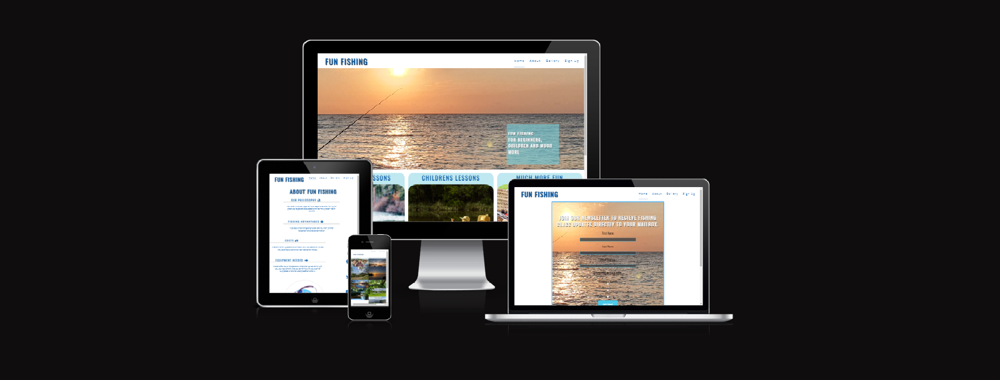
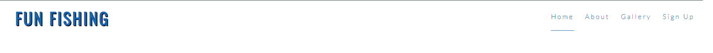
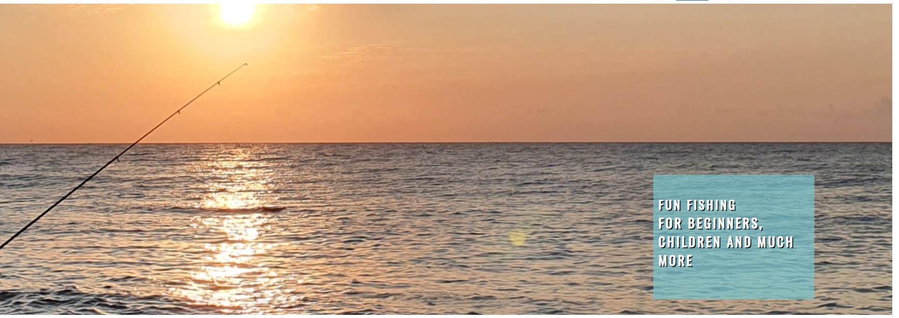
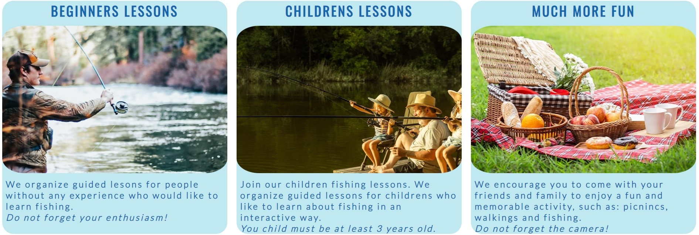
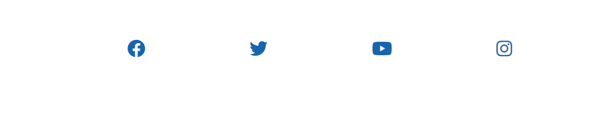
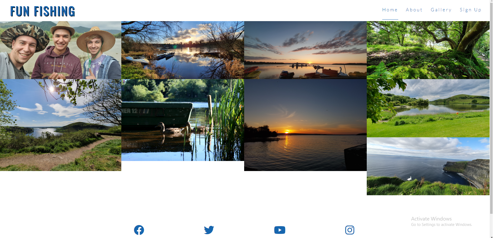
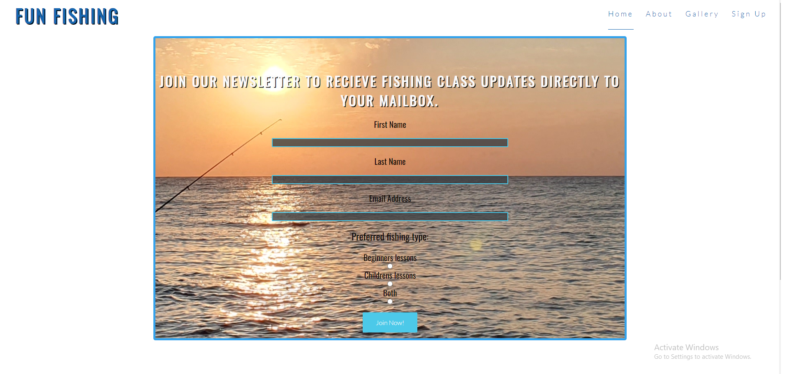
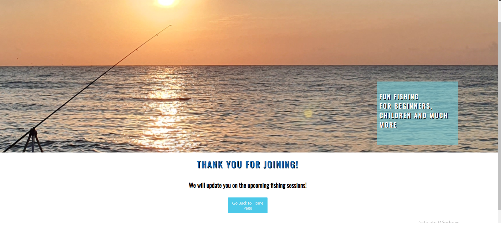

# Fun Fishing - Portofolio Project 1
Fun fishing site is a fishing club page for beginners and children, but also can be for all the family and friends because includes ohter activites than fishing. 

It gives an insight into some fishing classes for beginners  and childrens, and general informations about fishing classes like: costs, equipment needed and a few fishing advantages.

The website has a gallery page which lets the user to see all the experince.

It also has a sign up page which allows the user to join our mailing list which informs them about the upcoming fishing classes 

The aim of the project is to build a responsive website using HTML and CSS.

[Live Link to the website](https://ionelasabinamacovei.github.io/Portfolio-Project-1/)

## __Features__

-__Logo and Navigation Bar__

 - The logo and navigation bar is featured on all four pages.
 - The logo can be clicked to bring you back to the home and the navigation menu takes you to the correct pages. This is responsive on every screen size.

 

 -__Main Image__

 - This main image introduces the user to Fun Fishing with an eye catching animation to grab their attention.
 - The main image contains a text box with the title of the page and for who is designed this page.

 

 -__Activities Section__

 - The activities section will allow the user to see the main activities which are dedicated for beginers, childrens and also can be dedicated for all the family and friends.

 

 -__The Footer__

 - The footer section includes links to the relevant social media sites for Fun Fishing. The links will open to a new tab to allow easy navigation for the user.
 - The footer stays the same on every page.
 

### About

-The about page will allow the user to see the benefits, costs and equipment needed for fishing classes.

### Gallery

- The gallery will provide the user with supporting images to see what the fishing experience look like. 

### Sign-up

- The sign-up page asks the users to enter their name, email and choose an option for the type of fishing they would like to do. When submitting details users are directed to a Thank you Page.

### Thank you Page

The thank you page displays a thankyou message after the users have submitted their form and has a button that takes the users back to the home page.

## __Testing__

### User Testing

- The website works well on every other device and is responsive to different screen sizes.

- After deploying the site, the website was checked by friends and family on different devices.

- The site was tested on different browsers like Chrome, Edge and Firefox and had no issues.

- The footer links work perfectly and open on a new page.

- Once the form is submitted it displays a thank you message. The button on thank yo page also works fine and takes the users back to home page.

### Validator Testing

- HTML
    - No errors were found when passing the index.html page through the [W3C validator](https://validator.w3.org/nu/?showsource=yes&doc=https%3A%2F%2Fionelasabinamacovei.github.io%2FPortfolio-Project-1%2F)

    - No errors were found when passing the about.html page through the validator [W3C valiadtor](https://validator.w3.org/nu/?showsource=yes&doc=https%3A%2F%2Ffatimaqais.github.io%2Fdaily-yoga%2Fyogaposes.html)

    - No errors were found when passing the gallery.html page through the validator [W3C validator](https://validator.w3.org/nu/?showsource=yes&doc=https%3A%2F%2Ffatimaqais.github.io%2Fdaily-yoga%2Fjoinus.html)

    - No errors were found when passing the sign-up.html page through the validator [W3C validator](https://validator.w3.org/nu/?showsource=yes&doc=https%3A%2F%2Fionelasabinamacovei.github.io%2FPortfolio-Project-1%2Fsign-up.html)

