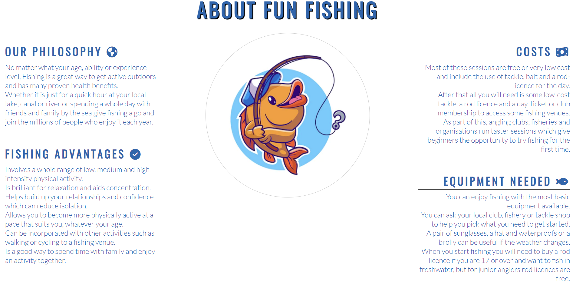

# Fun Fishing - Portofolio Project 1
Fun fishing site is a fishing club page for beginners and children, but also can be for all the family and friends because includes ohter activites than fishing. 

It gives an insight into some fishing classes for beginners  and childrens, and general informations about fishing classes like: costs, equipment needed and a few fishing advantages.

The website has a gallery page which lets the user to see all the experince.

It also has a sign up page which allows the user to join our mailing list which informs them about the upcoming fishing classes 

The aim of the project is to build a responsive website using HTML and CSS.

[Live Link to the website](https://ionelasabinamacovei.github.io/Fun-Fishing-Portofolio1/)

## __User Experience (UX) and Design__

### __User Stories__

- As a user, I would like to see what kind of fishing can be offer by the fishing club which can be seen on the home page.
- As a user, I would like to see know about the fishing club and their philosophi.
- As a user, I would like to see images from fishing classes.
- As a user, I would like to sign up for fishing classes.

### __Color Scheme__

- The color scheme for this page was taken from [coolors](https://coolors.co/1666af-3a3a3a-bfe8f0-fafafa-78c4ce).
- Some colours were adjusted accordingly to improve visibility.

### __Wireframes__
- The wireframes were created with [Balsamiq Wireframes](https://balsamiq.com) as a base to build the website. The developper took the liberty to improove the design during the development. 
- To check out the wireframes for this project, [click here](/Wireframes.md)

## __Features__

### Common Features

These features are on every page of the website for a consistent design

-__Logo and Navigation Bar__

 - The logo and navigation bar is featured on all four pages.
 - The logo can be clicked to bring you back to the home and the navigation menu takes you to the correct pages. This is responsive on every screen size.

 

 -__The Footer__

 - The footer section includes links to the relevant social media sites for Fun Fishing. The links will open to a new tab to allow easy navigation for the user.
 - The footer stays the same on every page.
 

### Home
- Home page will present to the user the main fishing classes.

### About

- The about page will allow the user to see the benefits, costs and equipment needed for fishing classes.

### Gallery

- The gallery will provide the user with supporting images to see what the fishing experience look like. 

### Sign-up

- The sign-up page asks the users to enter their name, email and choose an option for the type of fishing they would like to do. When submitting details users are directed to a Thank you Page.

### Thank you Page

The thank you page displays a thankyou message after the users have submitted their form and has a button that takes the users back to the home page.

## __Testing__

### User Testing

- The website works well on every other device and is responsive to different screen sizes.

- After deploying the site, the website was checked by friends and family on different devices.

- The site was tested on different browsers like Chrome, Edge and Firefox and had no issues.

- The footer links work perfectly and open on a new page.

- Once the form is submitted it displays a thank you message. The button on thank yo page also works fine and takes the users back to home page.

### Manual Testing

- The logo and site name go back to the home page.
- The Navigation menu links open the correct pages.
- Hovering over the navigation links underline them to show users they are clickable.
- Pages links are underlined when the user is browsing the page.
- The footer links open in a new tab.
- The hero image animation works when the page is refreshed.
- Each field is required to send the form in sign-up page.
- The form sends the data correctly.
- Hovering the back home button change the color
- The back home button redirects to the home page. 

### Validator Testing

- HTML
    - No errors were found when passing the index.html page through the [W3C validator](https://validator.w3.org/nu/?doc=https%3A%2F%2F8000-ionelasabin-funfishingp-t92m5i3qu0x.ws-eu77.gitpod.io%2Findex.html)

    - No errors were found when passing the about.html page through the validator [W3C valiadtor](https://validator.w3.org/nu/?doc=https%3A%2F%2F8000-ionelasabin-funfishingp-t92m5i3qu0x.ws-eu77.gitpod.io%2Fabout.html)

    - No errors were found when passing the gallery.html page through the validator [W3C validator](https://validator.w3.org/nu/?doc=https%3A%2F%2F8000-ionelasabin-funfishingp-t92m5i3qu0x.ws-eu77.gitpod.io%2Fgallery.html)

    - No errors were found when passing the sign-up.html page through the validator [W3C validator](https://validator.w3.org/nu/?doc=https%3A%2F%2F8000-ionelasabin-funfishingp-t92m5i3qu0x.ws-eu77.gitpod.io%2Fsign-up.html)

    - No errors were found when passing the thank-you.html page through the validator [W3C validator](https://validator.w3.org/nu/?doc=https%3A%2F%2F8000-ionelasabin-funfishingp-t92m5i3qu0x.ws-eu77.gitpod.io%2Fthankyou.html)

- CSS 
    - No errors were found when passing through the official Jigsaw validator

### Performance and Accessibility Testing
The website was tested for performance and accessibilty using Lighthouse on google chrome's developer tools.

## __Issues and Bugs__ 

### First bug
- Expected - Footer is expected to stay at the bottom of the page.
- Testing - Scroll the page to see if the footer is at the bottom of the page.
- Result - The footer is staing closer to content.
- Fix - I added some height to pages and setting the foter to flex display.

### Second bug
- Expected - The social links from the footer have enought space between them.
- Testing - See if the social links have engouht space.
- Result - The soacial links dosent have space beteen them when scrooling down.
- Fix - Added  text alignement center to social links and setting the display : inline.

### Third bug
- Expected - Responsinvnes of the about page.
- Testing - Reducing teh size of the screen.
- Result - The about page dosent have a good responsivnes in the small screen sizes, everithing is distorted.
- Fix - This problem was solved by given the flex value to display and setting the directions to columns. In this way the text was nice aligned.

## __Deployement__

This website was deployed to GitHub Pages. The steps to deploy are:
- Log in to GitHub
- Go to the setting for this repository.
- Select pages in left hand navigation menu.
- From the source dropdown, select main branch and then press save.
- The site will be deployed now. It may take a few minutes to go live.

### Local Deployement
To fork this repository, follow these steps:
- Log in to GitHub
- Go to the repository
- On the top right corner, click on the button that says fork.

To clone this repository, follow the steps:
- Log in to GitHub
- Go to the repository
- Beside the gipod button, it is code button
- Press the Code button and the chose one of the two clonning methods
- 1. The first one is by copping the link 
- 2. The second one is by downloding(at the botom) by pressing Download ZIP.

### Frameworks, Libraries & Programs Used
- [Google Fonts](https://fonts.google.com/ "Link to Google Fonts") was used to import the fonts "Lato", and "Oswald".
- [Font Awesome](https://fontawesome.com/ "Link to FontAwesome") was used for the several icons.
- [GitPod](https://gitpod.io/ "Link to GitPod homepage") was used for writing, commiting, and pushing code.
- [GitHub](https://github.com/ "Link to GitHub")

## __Credits__

### Code
- The code for the footer was taken from Love running walkthrough project.[Code Institute's](https://codeinstitute.net/)
- The code idea for the nav bar, gallery and about pages was taken from the same above mentioned source. However, there are some style changes to suit my project. 
- Another sources used to create the home, sign-up and thank you page was two repositories but however, there are some style changes to suit my project.: 
- [Abyss-Dive-Club](https://github.com/LudovicLeGuen/Abyss-Dive-Club)
- [daily-yoga](https://github.com/fatimaqais/daily-yoga)

### Content
- The information in the about section is taken from: [The girls can](https://www.thisgirlcan.co.uk/activities/angling/?fbclid=IwAR0xI0jCI9EOliwbUc69vkkcyWgPZfRWVqODwttsDpws4wf813Z5EDzYcko)

### Media

- Pictures used on the site come from various websites and belong to several different owners and some of the pictures used are from personal folder.
https://unsplash.com/
https://www.bettycrocker.com/
https://www.freepik.com/
- The icons for about section were taken from:
https://fontawesome.com/

